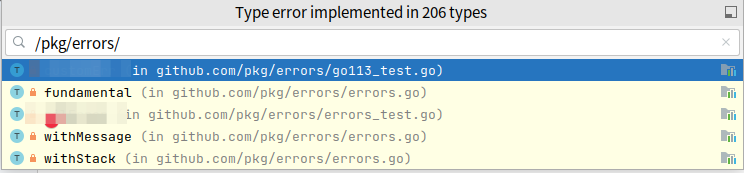

# Go 错误处理 - 最佳实践
## 背景

go 中 error 提供的信息往往是比较简洁的, 如可能存在以下错误：
``` 
_, err := os.Open("a.txt") // open a.txt: no such file or directory
```

但 error 出现在哪行, 调用堆栈是怎样的, 不得而知

## 解决方案

利用 [pkg/errors](https://github.com/pkg/errors) 库来 wrapper error

### 使用分析
`pkg/errors` 主要有两类 func

一类是 `Wrap`, 赋予 error context 的能力
```
// Wrap annotates cause with a message.
func Wrap(cause error, message string) error
```

另一类是 `Cause`, 获取 error chain 源头的 error

```
// Cause unwraps an annotated error.
func Cause(err error) error
```

`pkg/errors` 有三个实现 error 接口的 struct , 分别是 `fundamental`, `withStack`, `withMessage`




`fundamental` 通过 `errors.New(msg)` 创建, 用于初始化 error, 作为 error chain 的源头

`withMessage` 通过 `errors.WithMessage(err, msg)` 创建, 用于 wrapper 已有 error 并添加 msg

`withStack` 通过 `errors.WithStack(err)` 创建, 用于 wrapper 已有 error 并添加 trace, 若还需额外 msg 可使用 `errors.Wrap(err, msg)`

使用 `fmt.Printf("%+v", err)` 来打印 trace


### 示例代码

``` golang
// 使用 errors.Wrap 或 error.WithStack wrapper 原生的 error
func readFile(path string) ([]byte, error) {
	f, err := os.Open(path)
        defer f.Close()
	if err != nil {		
		return []byte{}, errors.Wrap(err, "open failed")
	}
	bytes, err := ioutil.ReadAll(f)
	return bytes, errors.WithStack(err)
}
```

```golang
// 调用
func CopyFile(old string, new string) error {
	log.Print("start to copy file")
	bytes, err := readFile(old)
	if err != nil {
		// 接受到下层传递的 context err，有以下两种方式：
		// 1.透传
		//return err
		// 2. 添加本层信息
		return errors.WithMessage(err, "copy failed")
		// Warning: 切勿使用 errors.Wrap, trace 信息会重复
		// return errors.Wrap(err, "copy failed")
	}
	return writeFile(new, bytes)
}
```
## 规范
- 总是使用 [pkg/errors](https://github.com/pkg/errors) wrapper go 原生 err, 包括第三方库返回的 err (除非能确定其已经使用 `pkg/errors` wrapper 了带有 context 的 error)
- 最下层函数返回带 context 的 error, 通过 `errors.New(msg)` 创建或者`errors.WithStack(err)/Wrap(err, msg)` wrapper, 在最上层函数统一处理(如日志打印 `fmt.Printf("%+v", err)`)
- 能处理则尽早处理, 不能处理则透传或使用 `errors.WithMessage(err, msg)` 在抛到上层函数

## 参考
- [dont-just-check-errors-handle-them-gracefully](https://dave.cheney.net/2016/04/27/dont-just-check-errors-handle-them-gracefully)
- [stack-traces-and-the-errors-package](https://dave.cheney.net/2016/06/12/stack-traces-and-the-errors-package)
- [errors-are-values](https://blog.golang.org/errors-are-values)