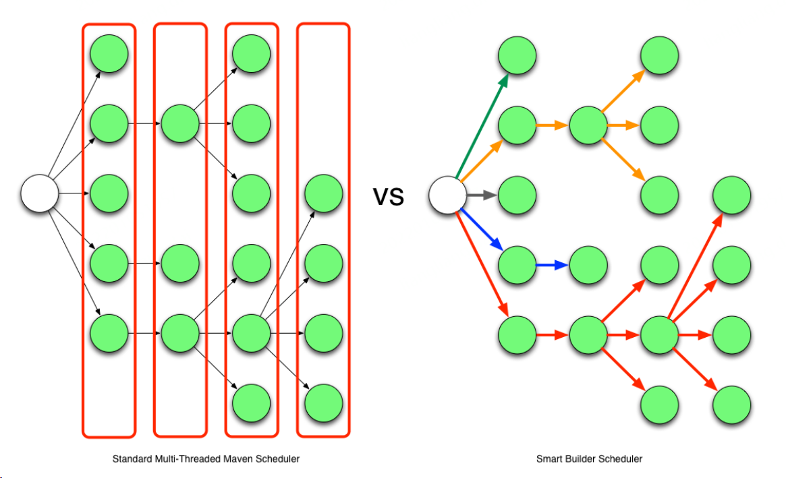

<head>
  <title>Head Metadata customized title!</title>
  <meta charSet="utf-8" />
  <meta name="mvnd" content="mvnd" />
</head>

[Mvnd(maven daemon)](https://github.com/apache/maven-mvnd) 借鉴了 gradle 和 takari 的技术, 旨在提升 maven 构建速度

本文通过实例测试及现有资料探索其较 maven3 的优势及使用场景


## 安装要求
[Mvnd 0.7.1](https://github.com/apache/maven-mvnd/tree/0.7.1) 运行依赖 jdk 11, 如不满足有以下提示:
```
org/mvndaemon/mvnd/client/DefaultClient has been compiled by a more recent version of the Java Runtime (class file version 55.0)
```
推荐使用 [jabba](https://github.com/shyiko/jabba) 管理 java 多版本

## 启停观察
执行 `mvnd` 命令即可观察到启动了 daemon 进程, 同时该命令也充当 client 与 daemon service 交互

执行 `mvnd --status` 查看 daemon 状态, 如下展示的是一个空闲状态的 daemon, 若无空闲 daemon 处理 client 请求, 则自动创建
```
liangliangdai@liangliangdai-VirtualBox:~/jacoco$ /home/liangliangdai/Downloads/mvnd-0.7.1-linux-amd64/bin/mvnd --status
      ID      PID                   Address   Status    RSS            Last activity  Java home                                                                                                                               
88a359ee    69068     inet:/127.0.0.1:36633     Idle   132m  2021-12-30T12:20:43.405  /home/liangliangdai/.jabba/jdk/openjdk@1.11.0
```
执行 `mvnd --stop` 停止 daemon

## 实例测试

### 事先说明
- 均基于 4 core linux 虚拟机
- 均设置 Jvm args `-Xms128M` `Xmx2048M`
- `-T 4` 表示开启并行构建的线程为 4 个

### [Jacoco](https://github.com/jacoco/jacoco/tree/v0.8.6) | 20 + modules

<details>
<summary> <code>mvn clean verify</code> 构建成功</summary>

```
[INFO] Reactor Summary for root 0.8.6:
[INFO] 
[INFO] JaCoCo ............................................. SUCCESS [  2.454 s]
[INFO] JaCoCo :: Core ..................................... SUCCESS [ 10.961 s]
[INFO] JaCoCo :: Report ................................... SUCCESS [  5.012 s]
[INFO] JaCoCo :: Agent RT ................................. SUCCESS [  2.425 s]
[INFO] JaCoCo :: Agent .................................... SUCCESS [  3.108 s]
[INFO] JaCoCo :: Ant ...................................... SUCCESS [  3.423 s]
[INFO] JaCoCo :: Command Line Interface ................... SUCCESS [  3.536 s]
[INFO] JaCoCo :: Examples ................................. SUCCESS [  3.183 s]
[INFO] JaCoCo :: Maven Plugin ............................. SUCCESS [  6.747 s]
[INFO] JaCoCo :: Tests .................................... SUCCESS [  0.192 s]
[INFO] JaCoCo :: Test :: Core ............................. SUCCESS [  6.984 s]
[INFO] JaCoCo :: Test :: Core :: Validation ............... SUCCESS [  0.049 s]
[INFO] JaCoCo :: Test :: Core :: Validation Java 5 ........ SUCCESS [  3.031 s]
[INFO] JaCoCo :: Test :: Core :: Validation Kotlin ........ SUCCESS [ 11.635 s]
[INFO] JaCoCo :: Test :: Core :: Validation Java 7 ........ SUCCESS [  2.744 s]
[INFO] JaCoCo :: Test :: Core :: Validation Java 8 ........ SUCCESS [  2.680 s]
[INFO] JaCoCo :: Test :: Core :: Validation Groovy ........ SUCCESS [  4.787 s]
[INFO] JaCoCo :: Test :: Core :: Validation Scala ......... SUCCESS [ 10.767 s]
[INFO] JaCoCo :: Test :: Report ........................... SUCCESS [  5.021 s]
[INFO] JaCoCo :: Test :: Agent RT ......................... SUCCESS [  3.188 s]
[INFO] JaCoCo :: Test :: Agent ............................ SUCCESS [  2.288 s]
[INFO] JaCoCo :: Test :: Ant .............................. SUCCESS [  8.807 s]
[INFO] JaCoCo :: Test :: Command Line Interface ........... SUCCESS [  4.286 s]
[INFO] JaCoCo :: Test :: Examples ......................... SUCCESS [ 17.863 s]
[INFO] JaCoCo :: Test :: Maven Plugin ..................... SUCCESS [01:59 min]
[INFO] JaCoCo :: Documentation ............................ SUCCESS [ 11.561 s]
[INFO] JaCoCo :: Distribution ............................. SUCCESS [  1.810 s]
[INFO] root ............................................... SUCCESS [  0.034 s]
[INFO] ------------------------------------------------------------------------
[INFO] BUILD SUCCESS
[INFO] ------------------------------------------------------------------------
[INFO] Total time:  04:18 min
```

</details>

<details>
<summary> <code>mvnd clean verify</code> 构建出错</summary>

```
[ERROR] Failed to execute goal org.apache.maven.plugins:maven-plugin-plugin:3.6.0:report (report) on project jacoco-maven-plugin: Execution report of goal org.apache.maven.plugins:maven-plugin-plugin:3.6.0:report failed: A required class was missing while executing org.apache.maven.plugins:maven-plugin-plugin:3.6.0:report: org/jacoco/report/check/IViolationsOutput
[ERROR] -----------------------------------------------------
[ERROR] realm =    plugin>org.apache.maven.plugins:maven-plugin-plugin:3.6.0
[ERROR] strategy = org.codehaus.plexus.classworlds.strategy.SelfFirstStrategy
[ERROR] urls[0] = file:/home/liangliangdai/.m2/repository/org/apache/maven/plugins/maven-plugin-plugin/3.6.0/maven-plugin-plugin-3.6.0.jar
[ERROR] urls[1] = file:/home/liangliangdai/.m2/repository/org/ow2/asm/asm/7.1/asm-7.1.jar
[ERROR] urls[2] = file:/home/liangliangdai/.m2/repository/org/sonatype/aether/aether-util/1.7/aether-util-1.7.jar
[ERROR] urls[3] = file:/home/liangliangdai/.m2/repository/org/sonatype/plexus/plexus-sec-dispatcher/1.3/plexus-sec-dispatcher-1.3.jar
[ERROR] urls[4] = file:/home/liangliangdai/.m2/repository/org/sonatype/plexus/plexus-cipher/1.4/plexus-cipher-1.4.jar
[ERROR] urls[5] = file:/home/liangliangdai/.m2/repository/org/codehaus/plexus/plexus-interpolation/1.14/plexus-interpolation-1.14.jar
[ERROR] urls[6] = file:/home/liangliangdai/.m2/repository/org/sonatype/sisu/sisu-inject-bean/1.4.2/sisu-inject-bean-1.4.2.jar
[ERROR] urls[7] = file:/home/liangliangdai/.m2/repository/org/sonatype/sisu/sisu-guice/2.1.7/sisu-guice-2.1.7-noaop.jar
[ERROR] urls[8] = file:/home/liangliangdai/.m2/repository/org/codehaus/plexus/plexus-component-annotations/1.5.5/plexus-component-annotations-1.5.5.jar
[ERROR] urls[9] = file:/home/liangliangdai/.m2/repository/org/apache/maven/plugin-tools/maven-plugin-tools-api/3.6.0/maven-plugin-tools-api-3.6.0.jar
[ERROR] urls[10] = file:/home/liangliangdai/.m2/repository/org/apache/maven/plugin-tools/maven-plugin-tools-generators/3.6.0/maven-plugin-tools-generators-3.6.0.jar
[ERROR] urls[11] = file:/home/liangliangdai/.m2/repository/org/ow2/asm/asm-commons/7.0/asm-commons-7.0.jar
[ERROR] urls[12] = file:/home/liangliangdai/.m2/repository/org/ow2/asm/asm-tree/7.0/asm-tree-7.0.jar
[ERROR] urls[13] = file:/home/liangliangdai/.m2/repository/org/ow2/asm/asm-analysis/7.0/asm-analysis-7.0.jar
[ERROR] urls[14] = file:/home/liangliangdai/.m2/repository/net/sf/jtidy/jtidy/r938/jtidy-r938.jar
[ERROR] urls[15] = file:/home/liangliangdai/.m2/repository/org/apache/maven/plugin-tools/maven-plugin-tools-java/3.6.0/maven-plugin-tools-java-3.6.0.jar
[ERROR] urls[16] = file:/home/liangliangdai/.m2/repository/com/thoughtworks/qdox/qdox/2.0-M5/qdox-2.0-M5.jar
[ERROR] urls[17] = file:/home/liangliangdai/.m2/repository/org/apache/maven/plugin-tools/maven-plugin-tools-annotations/3.6.0/maven-plugin-tools-annotations-3.6.0.jar
[ERROR] urls[18] = file:/home/liangliangdai/.m2/repository/org/codehaus/plexus/plexus-archiver/3.6.0/plexus-archiver-3.6.0.jar
[ERROR] urls[19] = file:/home/liangliangdai/.m2/repository/org/codehaus/plexus/plexus-io/3.0.1/plexus-io-3.0.1.jar
[ERROR] urls[20] = file:/home/liangliangdai/.m2/repository/commons-io/commons-io/2.6/commons-io-2.6.jar
[ERROR] urls[21] = file:/home/liangliangdai/.m2/repository/org/apache/commons/commons-compress/1.16.1/commons-compress-1.16.1.jar
[ERROR] urls[22] = file:/home/liangliangdai/.m2/repository/org/objenesis/objenesis/2.6/objenesis-2.6.jar
[ERROR] urls[23] = file:/home/liangliangdai/.m2/repository/org/iq80/snappy/snappy/0.4/snappy-0.4.jar
[ERROR] urls[24] = file:/home/liangliangdai/.m2/repository/org/tukaani/xz/1.8/xz-1.8.jar
[ERROR] urls[25] = file:/home/liangliangdai/.m2/repository/org/apache/maven/plugin-tools/maven-plugin-annotations/3.6.0/maven-plugin-annotations-3.6.0.jar
[ERROR] urls[26] = file:/home/liangliangdai/.m2/repository/org/apache/maven/doxia/doxia-sink-api/1.4/doxia-sink-api-1.4.jar
[ERROR] urls[27] = file:/home/liangliangdai/.m2/repository/org/apache/maven/doxia/doxia-logging-api/1.4/doxia-logging-api-1.4.jar
[ERROR] urls[28] = file:/home/liangliangdai/.m2/repository/org/apache/maven/doxia/doxia-site-renderer/1.4/doxia-site-renderer-1.4.jar
[ERROR] urls[29] = file:/home/liangliangdai/.m2/repository/org/apache/maven/doxia/doxia-core/1.4/doxia-core-1.4.jar
[ERROR] urls[30] = file:/home/liangliangdai/.m2/repository/xerces/xercesImpl/2.9.1/xercesImpl-2.9.1.jar
[ERROR] urls[31] = file:/home/liangliangdai/.m2/repository/xml-apis/xml-apis/1.3.04/xml-apis-1.3.04.jar
[ERROR] urls[32] = file:/home/liangliangdai/.m2/repository/org/apache/httpcomponents/httpclient/4.0.2/httpclient-4.0.2.jar
[ERROR] urls[33] = file:/home/liangliangdai/.m2/repository/commons-codec/commons-codec/1.3/commons-codec-1.3.jar
[ERROR] urls[34] = file:/home/liangliangdai/.m2/repository/org/apache/httpcomponents/httpcore/4.0.1/httpcore-4.0.1.jar
[ERROR] urls[35] = file:/home/liangliangdai/.m2/repository/org/apache/maven/doxia/doxia-decoration-model/1.4/doxia-decoration-model-1.4.jar
[ERROR] urls[36] = file:/home/liangliangdai/.m2/repository/org/apache/maven/doxia/doxia-module-xhtml/1.4/doxia-module-xhtml-1.4.jar
[ERROR] urls[37] = file:/home/liangliangdai/.m2/repository/org/apache/maven/doxia/doxia-module-fml/1.4/doxia-module-fml-1.4.jar
[ERROR] urls[38] = file:/home/liangliangdai/.m2/repository/org/codehaus/plexus/plexus-i18n/1.0-beta-7/plexus-i18n-1.0-beta-7.jar
[ERROR] urls[39] = file:/home/liangliangdai/.m2/repository/org/apache/velocity/velocity-tools/2.0/velocity-tools-2.0.jar
[ERROR] urls[40] = file:/home/liangliangdai/.m2/repository/commons-beanutils/commons-beanutils/1.7.0/commons-beanutils-1.7.0.jar
[ERROR] urls[41] = file:/home/liangliangdai/.m2/repository/commons-digester/commons-digester/1.8/commons-digester-1.8.jar
[ERROR] urls[42] = file:/home/liangliangdai/.m2/repository/commons-chain/commons-chain/1.1/commons-chain-1.1.jar
[ERROR] urls[43] = file:/home/liangliangdai/.m2/repository/commons-logging/commons-logging/1.1/commons-logging-1.1.jar
[ERROR] urls[44] = file:/home/liangliangdai/.m2/repository/javax/servlet/servlet-api/2.3/servlet-api-2.3.jar
[ERROR] urls[45] = file:/home/liangliangdai/.m2/repository/dom4j/dom4j/1.1/dom4j-1.1.jar
[ERROR] urls[46] = file:/home/liangliangdai/.m2/repository/oro/oro/2.0.8/oro-2.0.8.jar
[ERROR] urls[47] = file:/home/liangliangdai/.m2/repository/sslext/sslext/1.2-0/sslext-1.2-0.jar
[ERROR] urls[48] = file:/home/liangliangdai/.m2/repository/org/apache/struts/struts-core/1.3.8/struts-core-1.3.8.jar
[ERROR] urls[49] = file:/home/liangliangdai/.m2/repository/antlr/antlr/2.7.2/antlr-2.7.2.jar
[ERROR] urls[50] = file:/home/liangliangdai/.m2/repository/org/apache/struts/struts-taglib/1.3.8/struts-taglib-1.3.8.jar
[ERROR] urls[51] = file:/home/liangliangdai/.m2/repository/org/apache/struts/struts-tiles/1.3.8/struts-tiles-1.3.8.jar
[ERROR] urls[52] = file:/home/liangliangdai/.m2/repository/commons-collections/commons-collections/3.2.1/commons-collections-3.2.1.jar
[ERROR] urls[53] = file:/home/liangliangdai/.m2/repository/org/apache/maven/reporting/maven-reporting-impl/2.3/maven-reporting-impl-2.3.jar
[ERROR] urls[54] = file:/home/liangliangdai/.m2/repository/backport-util-concurrent/backport-util-concurrent/3.1/backport-util-concurrent-3.1.jar
[ERROR] urls[55] = file:/home/liangliangdai/.m2/repository/org/apache/maven/shared/maven-shared-utils/0.6/maven-shared-utils-0.6.jar
[ERROR] urls[56] = file:/home/liangliangdai/.m2/repository/com/google/code/findbugs/jsr305/2.0.1/jsr305-2.0.1.jar
[ERROR] urls[57] = file:/home/liangliangdai/.m2/repository/commons-validator/commons-validator/1.3.1/commons-validator-1.3.1.jar
[ERROR] urls[58] = file:/home/liangliangdai/.m2/repository/org/apache/maven/reporting/maven-reporting-api/3.0/maven-reporting-api-3.0.jar
[ERROR] urls[59] = file:/home/liangliangdai/.m2/repository/org/codehaus/plexus/plexus-utils/3.0.20/plexus-utils-3.0.20.jar
[ERROR] urls[60] = file:/home/liangliangdai/.m2/repository/org/codehaus/plexus/plexus-velocity/1.1.8/plexus-velocity-1.1.8.jar
[ERROR] urls[61] = file:/home/liangliangdai/.m2/repository/junit/junit/3.8.1/junit-3.8.1.jar
[ERROR] urls[62] = file:/home/liangliangdai/.m2/repository/org/apache/maven/surefire/maven-surefire-common/2.19.1/maven-surefire-common-2.19.1.jar
[ERROR] urls[63] = file:/home/liangliangdai/.m2/repository/org/apache/maven/surefire/surefire-api/2.19.1/surefire-api-2.19.1.jar
[ERROR] urls[64] = file:/home/liangliangdai/.m2/repository/org/apache/maven/surefire/surefire-booter/2.19.1/surefire-booter-2.19.1.jar
[ERROR] urls[65] = file:/home/liangliangdai/.m2/repository/org/apache/commons/commons-lang3/3.1/commons-lang3-3.1.jar
[ERROR] urls[66] = file:/home/liangliangdai/.m2/repository/org/apache/velocity/velocity/1.7/velocity-1.7.jar
[ERROR] urls[67] = file:/home/liangliangdai/.m2/repository/commons-lang/commons-lang/2.4/commons-lang-2.4.jar
[ERROR] Number of foreign imports: 1
[ERROR] import: Entry[import  from realm ClassRealm[maven.api, parent: null]]
[ERROR] 
[ERROR] -----------------------------------------------------
[ERROR] : org.jacoco.report.check.IViolationsOutput
[ERROR] -> [Help 1]
```
</details>

### [Sonar-java](https://github.com/SonarSource/sonar-java/tree/6.7.0.23054) | 10 ~ modules

**Case1: maven3 - Single thread build 耗时 | `mvn clean verify`**

| 次数| 时间|
| ------ | ------ |
| 1| 02:27 min|
| 2| 02:28 min|

**Case2: maven3 - Multi thread build 耗时 | `mvn clean verify -T 4`**

| 次数| 时间|
| ------ | ------ |
| 1| 02:18 min |
| 2| 02:23 min |

**Case3: mvnd - Multi thread build, 首次启动 daemon 并构建耗时 | `mvnd clean verify -T 4`**

注: 首次启动是指无 daemon 运行在后台，daemon 需与本次构建一起启动

| 次数| 时间|
| ------ | ------ |
| 1| 02:13 min |
| 2| 02:08 min |

**Case4: mvnd - Multi thread build, 预热 daemon 后构建耗时, `mvnd clean verify -T 4`**

| 次数| 时间|
| ------ | ------ |
| 1| 01:56 min |
| 2| 01:51 min |

从 case4 与 case1 可得出最优情况下 mvnd 大约可以为此项目提高 20% 的构建速度

## 结论

###  C/S 及 smart builder 是其快的关键因素

Mvnd 借鉴 [gradle daemon](https://docs.gradle.org/current/userguide/gradle_daemon.html), 使其一直处于后台运行, 从而充分利用 jvm classloader cache 及 JIT 的优势, 同时 GraalVM 构建的 client 拥有较高的性能. C/S 架构是 mvnd 构建快的关键因素之一

Mvnd 借鉴 [takari smart builder](http://takari.io/book/30-team-maven.html#takari-smart-builder), 相比与 maven3 并行构建模型更优. 此为 mvnd 构建快的另一关键因素. 下图展示了 maven 3 和 mvnd parallel build 模型的区别


> sonar-java 的测试中, case4 优于 case3 很好的体现了 daemon 的优势

> sonar-java 的测试中, case3 略由于 case2 的优势可能来自 smart build, 当然模型与项目结构等有一定关系且此处数据样本太少, 各位读者可自行测试

### 相比与 CI, mvnd 更适合本地构建

目之所及, CI 环境中大部分 java 应用还是串行构建, 一小部分可能使用了 maven3 的并行构建, 而 mvnd 集成于 CI 无疑是直接断了 "右臂" --- daemon

> sonar-java 的测试中, case3 可理解为 CI 中运行情况

> mvnd is primarily designed for iterative development on a developer workstation. I think it is worth trying as a drop-in replacement of stock Maven. In case of issues, the users are invited to report them in the project. I see little potential for mvnd in the area of continuous integration (CI). <br/>来源: [Conversation with Peter Palaga and Guillaume Nodet ](https://www.infoq.com/news/2020/12/mvnd-mavens-speed-daemon/)

### 并行构建不能无脑使用

[mvnd-parallel-builds.html](https://peter.palaga.org/2021/01/11/mvnd-parallel-builds.html#smart_builder_by_default) 列举了可能遇到的问题

可查阅作者向社区反馈的[问题](https://github.com/apache/maven-mvnd/issues/558) 

## 参考
- [gradle-vs-maven-performance](https://gradle.org/gradle-vs-maven-performance/)
- [mvnd-mavens-speed-daemon](https://www.infoq.com/news/2020/12/mvnd-mavens-speed-daemon/)
- [mvnd-parallel-builds.html](https://peter.palaga.org/2021/01/11/mvnd-parallel-builds.html#smart_builder_by_default)
